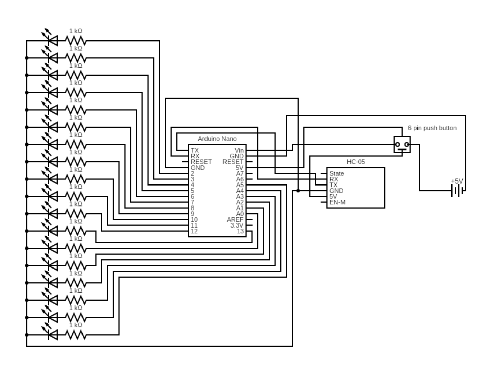
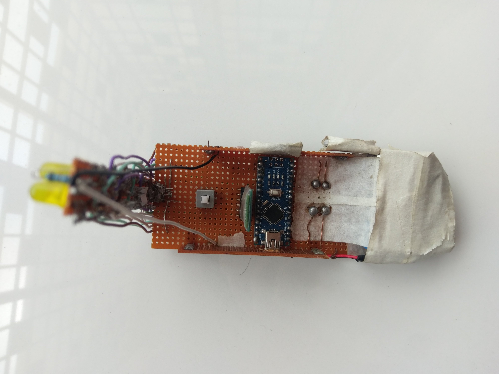
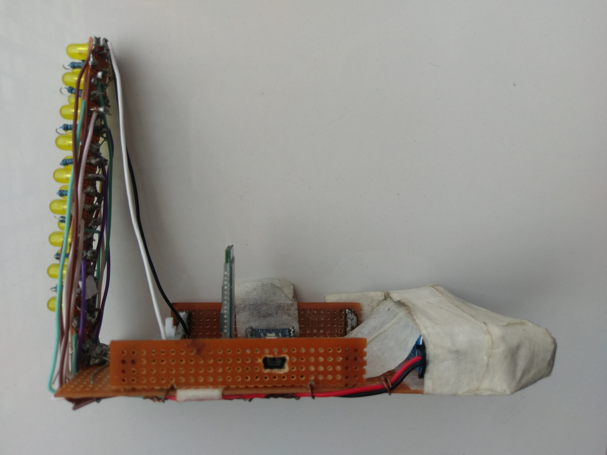
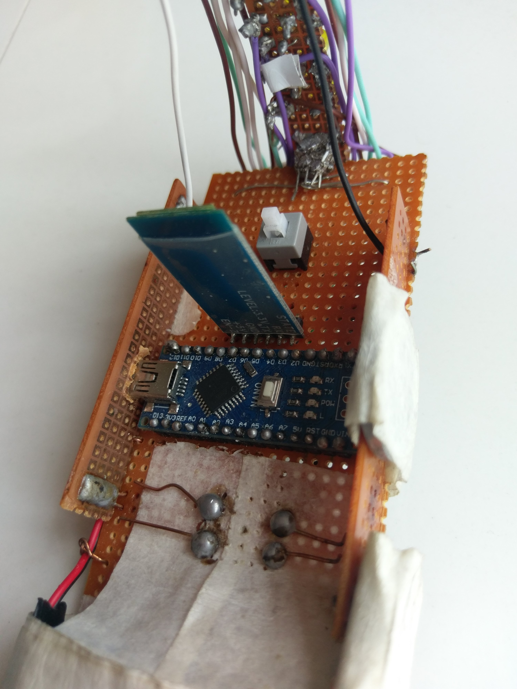
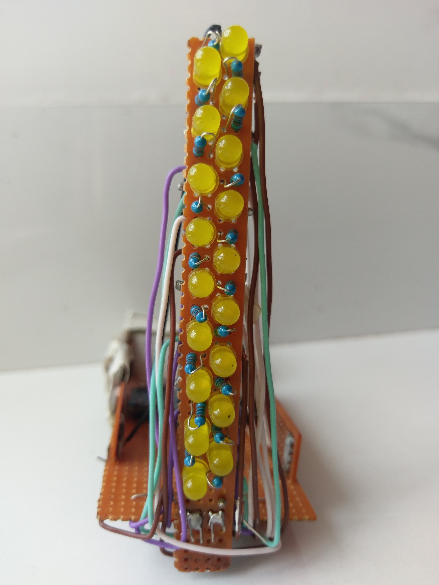
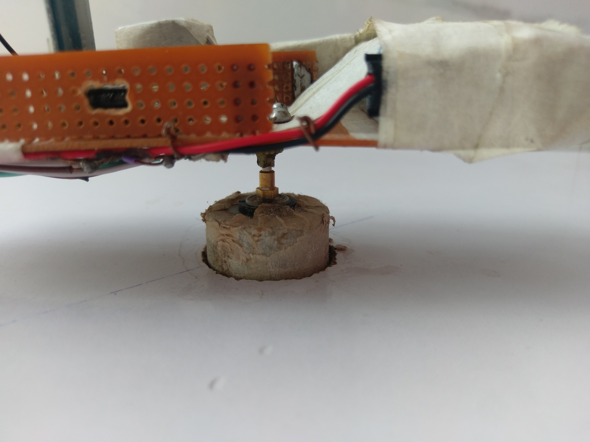
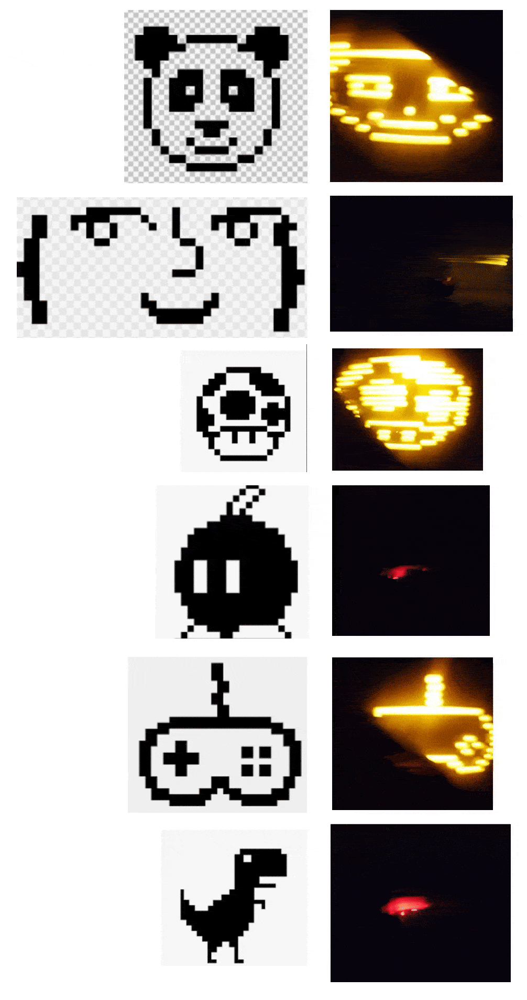

## Introduction

This is a cylindrical [POV Display](https://en.wikipedia.org/wiki/Persistence_of_vision#LED_POV_displays). The cylinder is 18 pixels (LEDs) high. The circumference of the cyclinder can be divided up into as many virtual pixels as needed programmaticaly. The default value has been set to 240 pixels. Thus the default effective resolution of this display is 240 pixels wide by 18 pixels high. Because the display is cylindrical, the entirety of it is never visible to an observer, so for the demonstrations that follow, only a quarter of the display has been used. Thus the viewing area has reduced to 60 pixels by 18 pixels. 

This is an MVP and it merely shows some of the capabilities of the assembled hardware. See [Future Plans](#future-plans).

## Circuit Diagram

## Pictures of Assembled Hardware

## Steps to Run
1. Press the Power ON button.
1. Pair the display with any device that can send serial data over bluetooth.
1. Turn on the motor which rotates the display.
1. Send commands over bluetooth serially to control the display. Alternatively, use the companion python GUI app made by [Saif Ullah Bin Khaki](https://github.com/SaifKhaki).

Commands | Descriptions
---: | :---
`p`      | Adjust time Period of rotation in milliseconds e.g. `p100.1` will set the period of rotation to 100.1 ms.
`c`       | Start Calibration mode: The display needs to be told what its period of rotation is. 
`f1`      | Display 'frame_no1'
`f2`      | Display 'frame_no2'
`f3`      | Display 'frame_no3'
`f4`      | Display 'frame_no4'
`f5`      | Display 'frame_no5'
`a1`      | Display 'animation_no1'
`m`       | Display music visualizer
`s`       | Before sending an encoded free-style frame, send this.
`q`       | Revert the last command (except `p`).

## Demonstrations

## Challenges Faced
+ **The Zig-Zag Arrangement of LEDs:** The Perf Board was not able to accomodate 18 LEDs in a straight line because the LEDs took too much space. They were arranged into a Zig-Zag pattern for a denser packing. But this introduced considerable complexity in the control logic of LEDs as displaying a picture with a straight line of LEDs is different than what we have here.

+ **The HC-05 Bluetooth Module:** Even the maximum baud rate of HC-05 was insufficient to transmit a live free-style frame. The solution was a special encoding of frame data before sending it and decoding it in Arduino. A custom technique was devised which reduced the frame size by a factor of 8.

+ **Arduino's Memory Limits:** The available flash memory of Arduino Nano is ~30KB. Storing even a single frame was posing to be a challenge so the plans were changing to transferring the data column by column instead of frame by frame. But thankfully, the encoding technique resolved this issue.

## Future Plans  
+ A nicer interface  
+ Live Drawing: The picture on the POV display will be drawn live with user's mouse movements.  
+ Audio Visualizer
+ Primitive GIF playback
